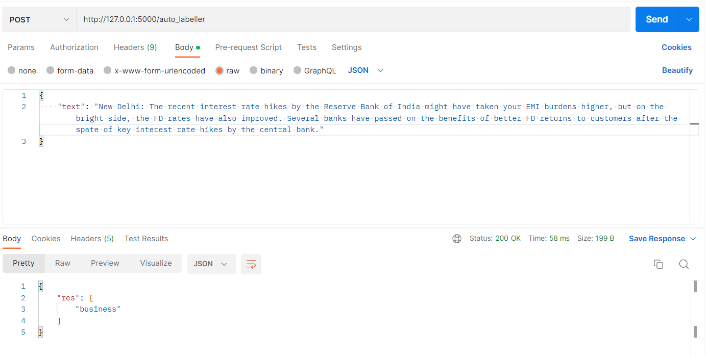

# News_Classifier_NLP

## 🪄 About
This is an End-to-End NLP project, which helps to predict the context or category for the given paragraph or document.

The project was created using Python Flask framework and integrated with Web API.


## 📈 DataSource

The datasource for this project was taken from Kaggle dataset "BBC News Classification".

Dataset : https://www.kaggle.com/competitions/learn-ai-bbc/data

## 💻 Output in Postman

<a></a>

## 🛠️ Requirement packages

* pandas
* matplotlib
* seaborn
* scikit-learn
* gensim
* db-sqlite3
* flask
* requests


## ⚙️ SetUp

1. Creating conda environment
 ``` 
 conda create -p venv python==3.7 -y 
 ```

2. For activating environment
```
"conda activate venv/"
```
3. For installing packages in requirements.txt
```
pip install -r requirements.txt
```

4. To add files to git
```
git add <file_name> => for adding single file to git.
git add . => for adding all the files to your local git.
```
5. To check the git status
```
git status
```
6. To create version/commit all the changes to git

```
git commit -m "Message"
```
7. To send version/changes to github.
```
git push origin main
```
